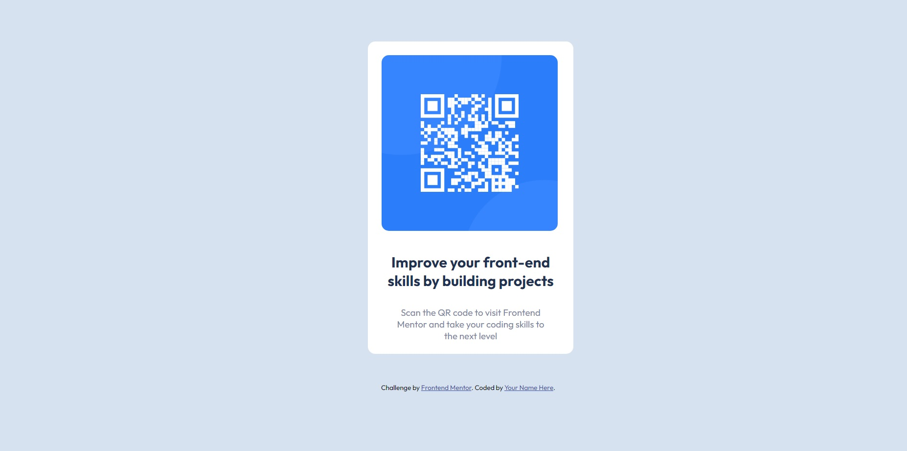
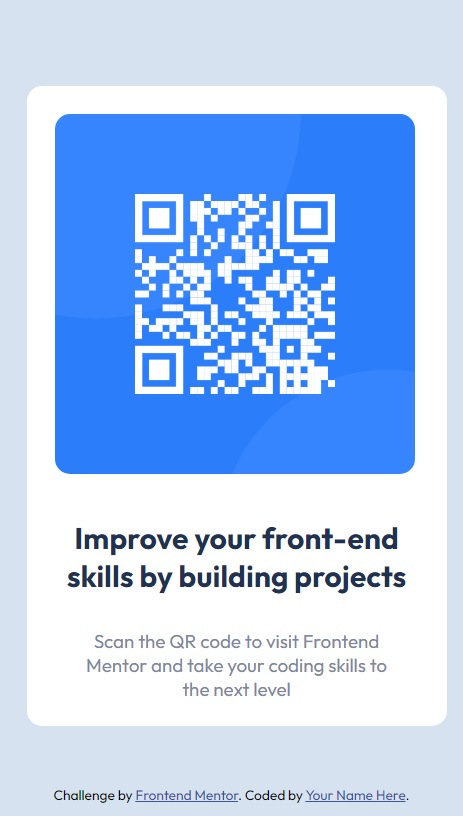

# Frontend Mentor - QR code component

## Table of contents

- [Overview](#overview)
  - [The challenge](#the-challenge)
  - [Screenshot](#screenshot)
  - [Links](#links)
- [My process](#my-process)
  - [Built with](#built-with)
  - [What I learned](#what-i-learned)
  - [Continued development](#continued-development)
  - [Useful resources](#useful-resources)
- [Author](#author)
- [Acknowledgments](#acknowledgments)

## Overview

### The challenge

Your challenge is to build out this QR code component and get it looking as close to the design as possible.

You can use any tools you like to help you complete the challenge. So if you've got something you'd like to practice, feel free to give it a go.

### Screenshot

### Links

- Solution URL: [Add solution URL here](https://github.com/coder-96/frontend-mentor-qr-code-component)
- Live Site URL: [Add live site URL here](https://coder-96.github.io/frontend-mentor-qr-code-component)

## My process

### Built with

- Semantic HTML5 markup & Non-Semantic HTML5
- CSS custom properties
- Flexbox
- Mobile-first workflow

### What I learned

Improved my raw CSS styling.

### Continued development

I'm focused on perfecting my skills on Responsive Design.

### Useful resources

- [MDN Web Docs](https://developer.mozilla.org/en-US/) - helped me find answers when I got stuck.

## Author

- Website - [Jalga](https://github.com/coder-96)
- Frontend Mentor - [@@coder-96](https://www.frontendmentor.io/profile/coder-96)

## Acknowledgments

I thank my family for supporting me on my way to becoming the best Full Stack Developer I can be. 